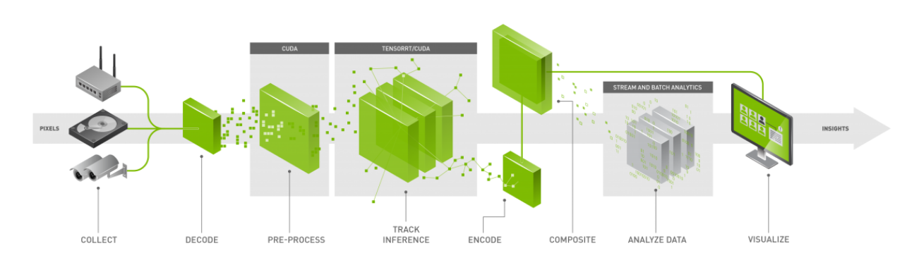
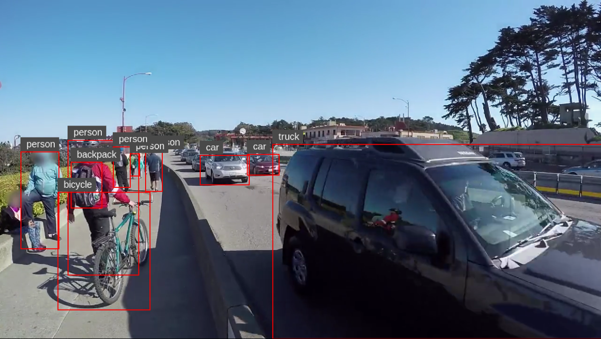
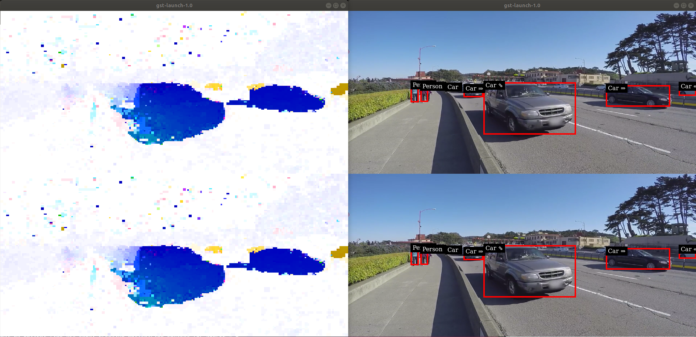
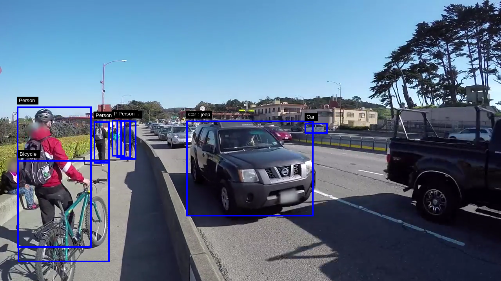

# Reference Apps for Video Analytics using TensorRT 5 and DeepStream SDK 3.0 #

This repository contains the reference applications for video analytics tasks using TensorRT and DeepSTream SDK 3.0.

  

## Getting Started ##
We currently provide four different reference applications:

For further details, please see each project's README.

### CaffeMNIST : [README](CaffeMNIST/README.md) ###

### Yolo : [README](yolo/README.md) ###
   Yolo is used to demonstrates object detection application. 
   The sample output from Deepstream yolo application is shown below. 

   

### Anomaly Detection : [README](anomaly/README.md) ###
  The project contains auxiliary plug-ins to show the capability of Deepstream SDK in anomaly detection.
  

### SENet : [README](senet/README.md) ###
  SENet is used to demonstrates secondary inference on detected objects. 
  The sample output from Deepstream senet application is shown below. 
   
