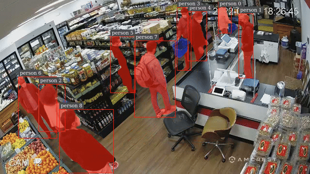
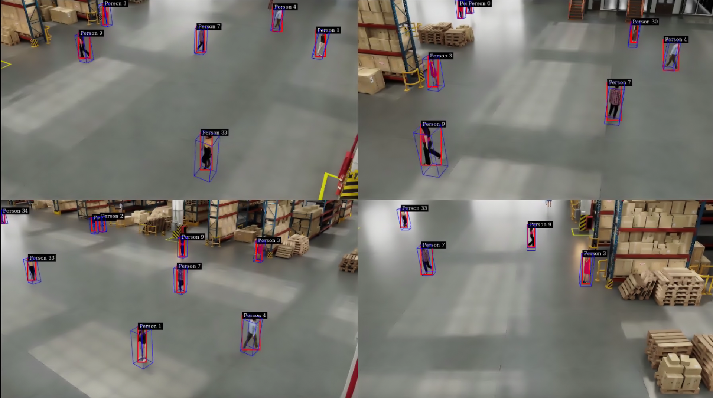
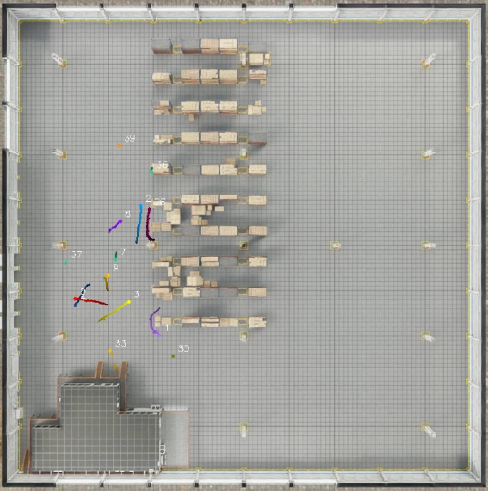

# Reference Apps using DeepStream 8.0

This repository contains the reference applications for video analytics tasks using TensorRT and DeepSTream SDK 8.0.

## Getting Started ##
We currently provide three different reference applications:

Preferably clone this project in
`/opt/nvidia/deepstream/deepstream/sources/apps/sample_apps/`

To clone the project in the above directory, sudo permission may be required.

For further details, please see each project's README.

### Anomaly Detection : [README](anomaly/README.md) ###
  The project contains auxiliary dsdirection plugin to show the capability of DeepstreamSDK in anomaly detection.
  
### Runtime Source Addition Deletion: [README](runtime_source_add_delete/README.md) ###
  The project demonstrates addition and deletion of video sources in a live Deepstream pipeline.
### MaskTracker: [README](deepstream-masktracker/README.md) ###
  This sample app demonstrates DeepStream MaskTracker for multi-object tracking and segmentation using SAM2.
  
### Single-View 3D Tracking: [README](deepstream-tracker-3d/README.md) ###
  The sample app demonstrates single-view 3D tracking with DeepStream multi-object tracking to reconstruct 3D human model in world coordinates under occlusion.
  
### Multi-View 3D Tracking: [README](deepstream-tracker-3d-multi-view) ###
  The samples demonstrate multi-view 3D tracking in DeepStream, a distributed, real-time framework designed for large-scale, calibrated camera networks.

   
### Parallel Multiple Models Inferencing: [README](deepstream_parallel_inference_app/README.md) ###
  The project demonstrate how to implement multiple models inferencing in parallel with DeepStream APIs.
### Bodypose 3D Model Inferencing: [README](deepstream-bodypose-3d/README.md) ###
  The sample demonstrate how to customize the multiple input layers model preprocessing and the customization of the bodypose 3D model postprocessing.
  
### Video Buffers sharing between pipelines through IPC: [README](deepstream-ipc-test-sr/README.md) ###
  This sample demonstrates how to share video buffers over IPC and how to change output video buffers.
### Multiple Dynamic Sources with Single Decoder:[README](deepstream-dynamicsrcbin-test/README) ###
 The sample demonstrates the usage of nvdsdynamicsrcbin in DeepStream pipeline.It helps to construct the application of multiple dynamic sources with a single video decoder to adapt to the high decoder throughput scenarios.

## Legacy DeepStream Reference Samples
Some old samples are not supported any more for different reasons. The legacy samples are moved to the legacy folder /legacy_apps.
