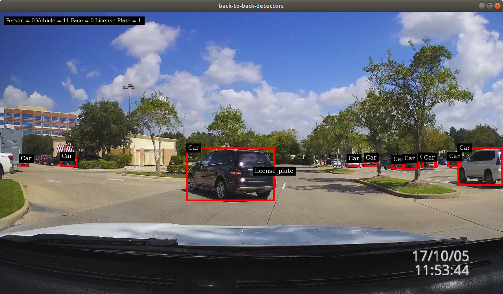

# Reference Apps using DeepStream 4.0

This repository contains the reference applications for video analytics tasks using TensorRT and DeepSTream SDK 4.0.

## Getting Started ##
We currently provide two different reference applications:

For further details, please see each project's README.

### back-to-back-detectors : [README](back-to-back-detectors/README.md) ###
  The project shows usage of 2 detectors in cascaded mode
  
### Anomaly Detection : [README](anomaly/README.md) ###
  The project contains auxiliary dsdirection plugin to show the capability of DeepstreamSDK in anomaly detection.
  
### runtime_source_add_delete : [README](runtime_source_add_delete/README.md) ###
  The project demonstrates adding and removing sources in runnning DeepStream pipeline.
