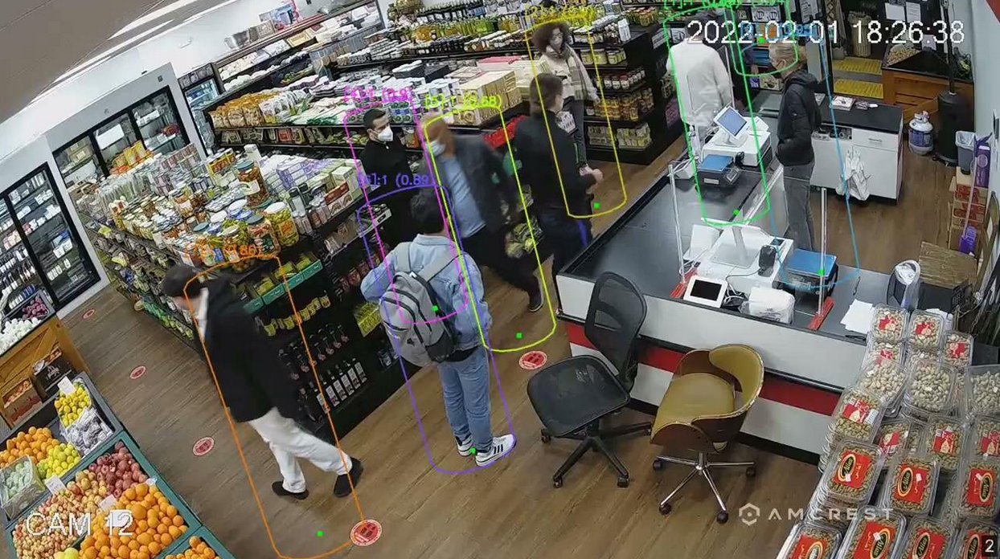

# Reference Apps using DeepStream 7.1

This repository contains the reference applications for video analytics tasks using TensorRT and DeepSTream SDK 7.1.

## Getting Started ##
We currently provide three different reference applications:

Preferably clone this project in
`/opt/nvidia/deepstream/deepstream/sources/apps/sample_apps/`

To clone the project in the above directory, sudo permission may be required.

For further details, please see each project's README.

### Anomaly Detection : [README](anomaly/README.md) ###
  The project contains auxiliary dsdirection plugin to show the capability of DeepstreamSDK in anomaly detection.
  
### Runtime Source Addition Deletion: [README](runtime_source_add_delete/README.md) ###
  The project demonstrates addition and deletion of video sources in a live Deepstream pipeline.
### Single-View 3D Tracking: [README](deepstream-tracker-3d/README.md) ###
  The sample demostrates usage of single-view 3D tracking with DeepStream nvtracker.
  
### Parallel Multiple Models Inferencing: [README](deepstream_parallel_inference_app/README.md) ###
  The project demonstrate how to implement multiple models inferencing in parallel with DeepStream APIs.
### Bodypose 3D Model Inferencing: [README](deepstream-bodypose-3d/README.md) ###
  The sample demonstrate how to customize the multiple input layers model preprocessing and the customization of the bodypose 3D model postprocessing.
  

## Legacy DeepStream Reference Samples
Some old samples are not supported any more for different reasons. The legacy samples are moved to the legacy folder /legacy_apps.
