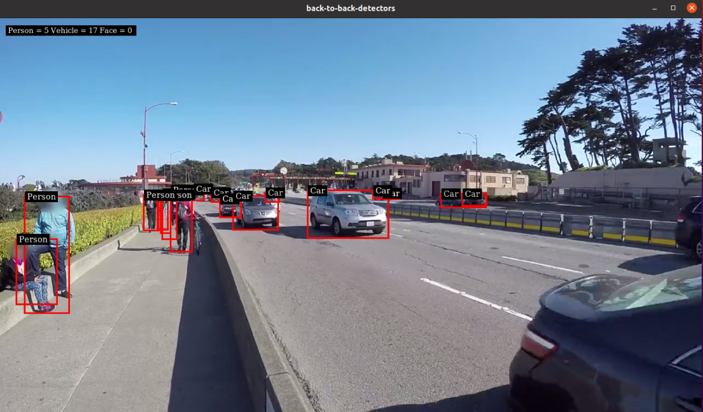
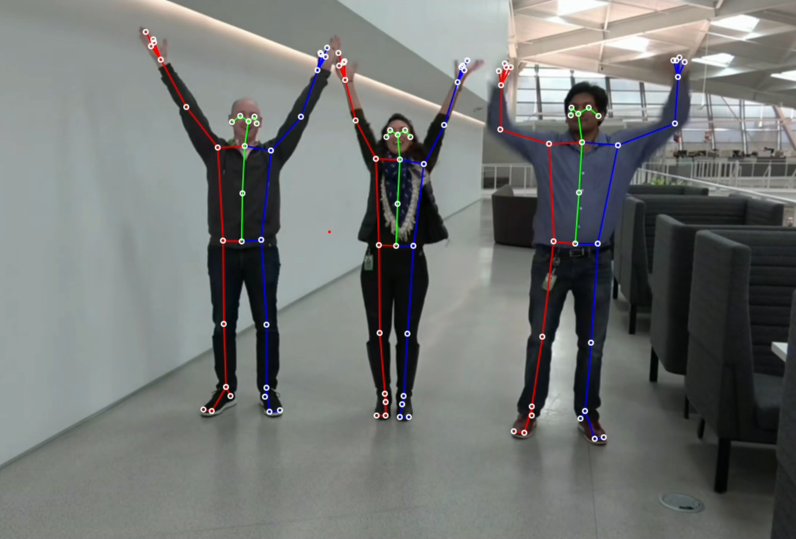

# Reference Apps using DeepStream 6.4

This repository contains the reference applications for video analytics tasks using TensorRT and DeepSTream SDK 6.4.

## Getting Started ##
We currently provide three different reference applications:

Preferably clone this project in
`/opt/nvidia/deepstream/deepstream/sources/apps/sample_apps/`

To clone the project in the above directory, sudo permission may be required.

For further details, please see each project's README.

### back-to-back-detectors : [README](back-to-back-detectors/README.md) ###
  The project shows usage of 2 detectors in cascaded mode
  
### Anomaly Detection : [README](anomaly/README.md) ###
  The project contains auxiliary dsdirection plugin to show the capability of DeepstreamSDK in anomaly detection.
  
### Runtime Source Addition Deletion: [README](runtime_source_add_delete/README.md) ###
  The project demonstrates addition and deletion of video sources in a live Deepstream pipeline.
### Body Pose 3D: [README](deepstream-bodypose-3d/README.md) ###
  The project demonstrates usage of Body Pose 3D model in Deepstream application
  
