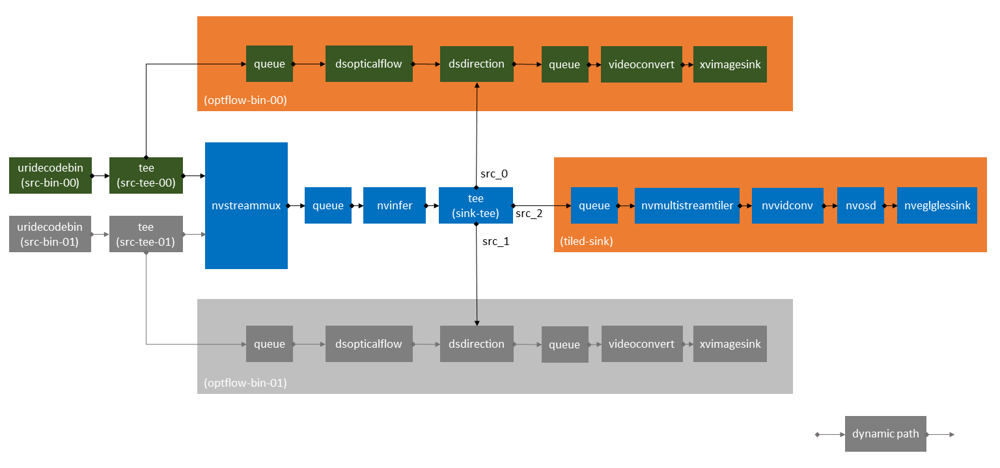
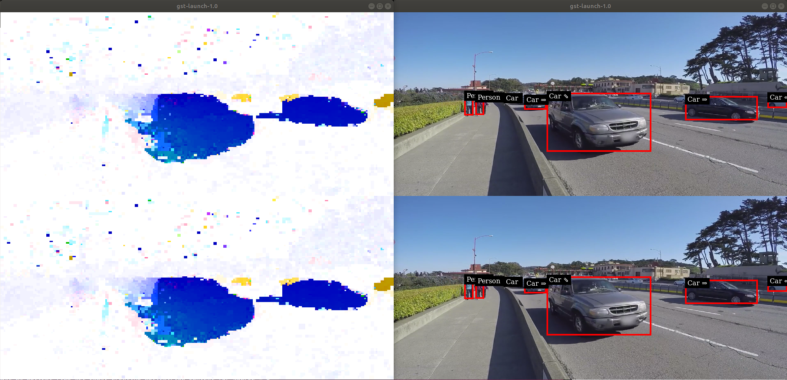

# Anomaly Detection Reference Apps using DeepStream SDK 3.0

## Introduction
The project contains a set of applications and auxiliary plug-ins to show the
capability of Deepstream SDK.

## Prerequisites

Install opencv-4.0.1 by following commands.

```
$ wget https://github.com/opencv/opencv/archive/4.0.1.zip
$ wget https://github.com/opencv/opencv_contrib/archive/4.0.1.zip
$ cd ~/opencv/
$ mkdir build
$ cd build
$ cmake -D CMAKE_BUILD_TYPE=RELEASE \
        -DCMAKE_INSTALL_PREFIX=/usr/local \
        -DWITH_CUDA=ON \
        -DINSTALL_PYTHON_EXAMPLES=ON \
        -DOPENCV_EXTRA_MODULES_PATH=~/opencv_contrib/modules \
        -DBUILD_EXAMPLES=ON \
        -DBUILD_opencv_cudacodec=OFF \
        -DCMAKE_CXX_FLAGS="" ..
$ sudo make;
$ sudo make install;
$ sudo ldconfig;
```

## Getting Started
After cloning the project, please download the latest Deepstream SDK from
https://developer.nvidia.com/deepstream-sdk, then unzip it and follow the README
file in Deepstream SDK to get the environment all set.

Export the environment variable: <br/>
`export DS_SDK_ROOT="your deepstream SDK root"`

## Build and Test Plugins
Auxiliary plugins are managed by cmake.
Auxiliary plugins can be tested with following pipelines with command line tool gst-launch.
You need to change OPENCV_ROOT value to your opencv installation path.

-  gst-dsopticalflow Plugin
```
$ cd anoamaly/plugins/gst-dsopticalflow
$ mkdir build
$ cd build
$ cmake -D CMAKE_BUILD_TYPE=RELEASE -D DS_SDK_ROOT=$DS_SDK_ROOT -D OPENCV_ROOT=<YOUR OPENCV PATH> ..
$ make
$ sudo make install
$ cd ../../../
```

- gst-dsdirection Plugin
```
$ cd anoamaly/plugins/gst-dsdirection
$ mkdir build
$ cd build
$ cmake -D CMAKE_BUILD_TYPE=RELEASE -D DS_SDK_ROOT=$DS_SDK_ROOT ..
$ make
For manual installation,
$ sudo cp libgstdsdirection.so.so ~/.local/share/gstreamer-1.0/plugins/
$ sudo make install
$ cd ../../../
```

1. To test dense optical flow calculation, run following commands
```
gst-launch-1.0 uridecodebin uri=file://$DS_SDK_ROOT/samples/streams/sample_720p.mp4 ! dsopticalflow ! videoconvert ! xvimagesink
gst-launch-1.0 uridecodebin uri=file://$DS_SDK_ROOT/samples/streams/sample_720p.mp4 ! dsopticalflow ! nvvidconv ! nveglglessink
gst-launch-1.0 uridecodebin uri=file://$DS_SDK_ROOT/samples/streams/sample_720p.mp4 ! tee name=t ! queue ! nveglglessink t. ! dsopticalflow ! queue ! videoconvert ! xvimagesink sync=false
gst-launch-1.0 nvstreammux name=streammux width=1280 height=720 batch-size=2 ! queue ! nvmultistreamtiler rows=2 columns=1 width=1280 height=1440 ! nvvidconv ! nveglglessink \
uridecodebin uri=file://$DS_SDK_ROOT/samples/streams/sample_720p.mp4 ! tee name=t0_0 ! streammux.sink_0 \
uridecodebin uri=file://$DS_SDK_ROOT/samples/streams/sample_720p.mp4 ! tee name=t0_1 ! streammux.sink_1 \
t0_0. ! dsopticalflow unique-id=0 ! queue ! videoconvert ! xvimagesink sync=false \
t0_1. ! dsopticalflow unique-id=1 ! queue ! videoconvert ! xvimagesink sync=false
```

2. To test direction calculation on one video input, run following commands
```
gst-launch-1.0 uridecodebin uri=file://$DS_SDK_ROOT/samples/streams/sample_720p.mp4 ! tee name=t0_0 ! .sink_0 nvstreammux name=streammux width=1280 height=720 batch-size=1 ! nvinfer config-file-path="config/ds_pgie_config.txt" batch-size=1 ! tee name=t1 ! .sink dsdirection name=m0 t0_0. ! dsopticalflow unique-id=0 enable-heatmap=false ! m0.optf_sink t1. ! queue ! nvvidconv ! nvosd ! nveglglessink
```

3. To test direction calculation using optical flow on two video inputs, with motion heat map output, run following commands
```
gst-launch-1.0 nvstreammux name=streammux width=1280 height=720 batch-size=2 ! nvinfer config-file-path="config/ds_pgie_config.txt" batch-size=2 ! tee name=t1 \
uridecodebin uri="file://$DS_SDK_ROOT/samples/streams/sample_720p.mp4" ! tee name=t0_0 ! streammux.sink_0 \
uridecodebin uri="file://$DS_SDK_ROOT/samples/streams/sample_720p.mp4" ! tee name=t0_1 ! streammux.sink_1 \
t0_0. ! dsopticalflow unique-id=0 ! .optf_sink dsdirection name=m0 ! queue ! videoconvert ! xvimagesink sync=false \
t0_1. ! dsopticalflow unique-id=1 ! .optf_sink dsdirection name=m1 ! queue ! videoconvert ! xvimagesink sync=false \
t1. ! m0.sink \
t1. ! m1.sink \
t1. ! queue ! nvmultistreamtiler rows=2 columns=1 width=1280 height=1440 ! nvvidconv ! nvosd ! nveglglessink
```
4. To test direction calculation using optical flow on two video inputs, without motion heat map output, , run following commands
```
gst-launch-1.0 nvstreammux name=streammux width=1280 height=720 batch-size=2 ! nvinfer config-file-path="config/ds_pgie_config.txt" batch-size=2 ! tee name=t1 \
uridecodebin uri=file://$DS_SDK_ROOT/samples/streams/sample_720p.mp4 ! tee name=t0_0 ! streammux.sink_0 \
uridecodebin uri=file://$DS_SDK_ROOT/samples/streams/sample_720p.mp4 ! tee name=t0_1 ! streammux.sink_1 \
t0_0. ! dsopticalflow unique-id=0 enable-heatmap=false ! .optf_sink dsdirection name=m0 \
t0_1. ! dsopticalflow unique-id=1 enable-heatmap=false ! .optf_sink dsdirection name=m1 \
t1. ! m0.sink \
t1. ! m1.sink \
t1. ! queue ! nvmultistreamtiler rows=2 columns=1 width=1280 height=1440 ! nvvidconv ! nvosd ! nveglglessink
```

## Build and Test Apps
### Deepstream Anomaly Detection App
Anomaly detection app is using a parrallelized pipeline to process two streams at the same time:


- Modify ds_pgie_config.txt under anomaly/config for /path/to/DeepStream/

  `model-file, proto-file, labelfile-path, int8-calib-file` need to be modified.

  For this example, all files are located in `path/to/Deeepstream/samples/models/Primary_Detector/`

- To build and run the app, you need also do cmake.
  ```
  $ cd anomaly/apps/deepstream-anomaly-detection
  $ mkdir build && cd build
  $ cmake -D DS_SDK_ROOT=$DS_SDK_ROOT ..
  $ make
  $ sudo make install
  $ cd ../../../
  $ deepstream-demo-app -i file://<path_to_video> -i file://<path_to_video_file> -c <path_to_ ds_pgie_config.txt> -m -g 4
  ```

  The result should be like below:
  
