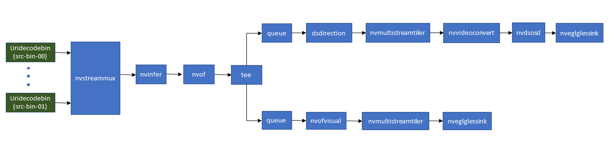

# ANOMALY DETECTION REFERENCE APP USING DEEPSTREAMSDK 6.4

## Introduction
The project contains anomaly detection application and auxiliary plug-ins to show the
capability of Deepstream SDK.

## Prequisites:
DeepStream SDK installed which is available at  http://developer.nvidia.com/deepstream-sdk
Please follow instructions in the `apps/sample_apps/deepstream-app/README` on how
to install the prequisites for Deepstream SDK apps.

## Getting Started

- Preferably clone the app in
  `/opt/nvidia/deepstream/deepstream/sources/apps/sample_apps/`

- Edit the `dsanomaly_pgie_config.txt` or `dsanomaly_pgie_nvinferserver_config.txt` according to the location of the models to be used


## Compilation Steps for dsdirection plugin
```
  $ cd plugins/gst-dsdirection/
  $ sudo make && sudo make install
```

1. Test direction calculation on one video input, on dGPU, run following commands
```
cd /opt/nvidia/deepstream/deepstream/
gst-launch-1.0 filesrc location = samples/streams/sample_1080p_h264.mp4 ! qtdemux ! h264parse ! nvv4l2decoder ! m.sink_0 \
nvstreammux name=m batch-size=1 width=1920 height=1080 ! nvinfer config-file-path= samples/configs/deepstream-app/config_infer_primary.txt  \
! nvof ! tee name=t ! queue ! nvofvisual ! nvmultistreamtiler width=1920 height=1080 !  nveglglessink t. ! queue ! dsdirection ! \
nvmultistreamtiler width=1920 height=1080 ! nvvideoconvert ! nvdsosd ! nveglglessink
```
2. Test direction calculation on one video input, on Jetson, run following commands
```
cd /opt/nvidia/deepstream/deepstream/
gst-launch-1.0 filesrc location = samples/streams/sample_1080p_h264.mp4 ! qtdemux ! h264parse ! nvv4l2decoder ! m.sink_0 \
nvstreammux name=m batch-size=1 width=1280 height=720 ! nvinfer config-file-path= samples/configs/deepstream-app/config_infer_primary.txt  \
! nvof ! tee name=t ! queue ! nvofvisual ! nvmultistreamtiler width=1920 height=1080 ! nv3dsink sync=0 t. ! queue ! dsdirection ! \
nvmultistreamtiler width=1920 height=1080 ! nvvideoconvert ! nvdsosd ! nv3dsink sync=0
```

3. Test direction calculation using optical flow on two video inputs on dGPU, run following commands
```
cd /opt/nvidia/deepstream/deepstream/
gst-launch-1.0 filesrc location = samples/streams/sample_1080p_h264.mp4 ! qtdemux ! h264parse ! nvv4l2decoder ! m.sink_0 \
nvstreammux name=m batch-size=2 width=1920 height=1080 ! nvinfer config-file-path= samples/configs/deepstream-app/config_infer_primary.txt ! \
nvof ! tee name=t ! queue ! nvofvisual ! nvmultistreamtiler width=1920 height=540 !  nveglglessink t. ! queue ! dsdirection ! \
nvmultistreamtiler width=1920 height=540 ! nvvideoconvert ! nvdsosd ! nveglglessink filesrc location = samples/streams/sample_1080p_h264.mp4 ! \
qtdemux ! h264parse ! nvv4l2decoder ! m.sink_1  --gst-debug=3

```
Anomaly detection app pipeline:


## Compilation Steps and Execution:
```
 $ cd sources/apps/sample_apps/deepstream_reference_apps/anomaly/
 $ cd apps/deepstream-anomaly-detection-test/
 $ Set CUDA_VER in the MakeFile as per platform.
     For both x86 & Jetson, CUDA_VER=12.2
 $ sudo make

 $ ./deepstream-anomaly-detection-app <uri1> [uri2] ... [uriN]
   Ex.: ./deepstream-anomaly-detection-app file:///opt/nvidia/deepstream/deepstream/samples/streams/sample_1080p_h264.mp4

Use option "-t inferserver" to select nvinferserver as the inference plugin
 $ ./deepstream-anomaly-detection-app -t inferserver <uri1> [uri2] ... [uriN]
   Ex.: ./deepstream-anomaly-detection-app -t inferserver file:///opt/nvidia/deepstream/deepstream/samples/streams/sample_1080p_h264.mp4
```
  The result should be like below:
  

## NOTE:
- Minimum supported resolution: DGPU - 160 x 64, Jetson - 256 x 96
- Due to an issue in nvofvisual plugin, when using nvofvisual along with nvof
  plugin, the width of input to nvof should be multiple of 32 on DGPU and multiple
  of 256 on Jetson. This will be fixed in the nvofvisual plugin in the next DeepStream
  release.
