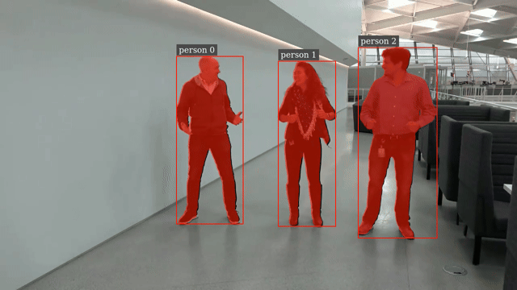

#  MaskTracker in DeepStream

Note: We are using internal DS docker image and GitLab links for review. For DS 8.0 release, the docker image will be published to NGC, and GitLab repos will be published to GitHub. We will replace all the internal links with public links.

## Introduction
This sample application demonstrates using MaskTracker with DeepStream SDK. MaskTracker simultaneously performs multi-object tracking and segmentation using advanced vision foundation models such as Segment Anything Model 2 (SAM2). It uses SAM2 to visually track and segment targets across frames, while automatically adding and removing targets as needed. It stores visual features in previous frames in a memory bank and use them to localize targets in a new frame.  For algorithm and setup details, please refer to [DeepStream MaskTracker Documentation](https://deepstreamsdk.gitlab-master-pages.nvidia.com/docs-template/text/DS_plugin_gst-nvtracker.html#masktracker-developer-preview).

## Prerequisites
Users need to install Ubuntu 24.04 and NVIDIA driver 570.133.20 on x86 with dGPUs supported by DeepStream. Jetson devices may not support running the entire SAM2 network due to resource limitation. Check [here](https://deepstreamsdk.gitlab-master-pages.nvidia.com/docs-template/text/DS_docker_containers.html#prerequisites) for DeepStream container setup.
1. Download the latest DeepStream container image from NGC (e.g., DS 8.0 in the example below)
    ```bash
    export DS_IMG_NAME="nvcr.io/nvidia/deepstream:8.0-triton-multiarch"
    docker pull $DS_IMG_NAME
    ```

2. Git clone `deepstream_tools` and the current `deepstream_reference_apps` repository to the host machine, and enter MaskTracker directory inside the repository. `deepstream_tools` contains a directory `sam2-onnx-tensorrt`, which will be used to convert SAM2 models for TensorRT inference later.
    ```bash
    # Clone both repositories into one folder
    git clone https://github.com/NVIDIA-AI-IOT/deepstream_tools.git
    git clone https://github.com/NVIDIA-AI-IOT/deepstream_reference_apps.git
    cd deepstream_reference_apps/deepstream-masktracker
    ```

3. Download NVIDIA pretrained `PeopleNet` for detection from [NGC](https://catalog.ngc.nvidia.com/orgs/nvidia/teams/tao/models/peoplenet/files?version=deployable_quantized_onnx_v2.6.3(e.g., PeopleNet v2.6.3 in the example below).

    ```bash
    # current directory: deepstream_reference_apps/deepstream-masktracker
    mkdir -p models/PeopleNet
    cd models/PeopleNet
    wget --no-check-certificate --content-disposition https://api.ngc.nvidia.com/v2/models/nvidia/tao/peoplenet/versions/deployable_quantized_onnx_v2.6.3/zip -O peoplenet_deployable_quantized_onnx_v2.6.3.zip
    unzip peoplenet_deployable_quantized_onnx_v2.6.3.zip
    ```

    The model files are now stored in `PeopleNet` directory as

    ```bash
    deepstream-masktracker
    ├── configs
    ├── streams
    └── models
        └── PeopleNet
            ├── labels.txt
            ├── resnet34_peoplenet.onnx
            └── resnet34_peoplenet_int8.txt
    ```
## Running the Application

Launch the container from current directory, and execute the MaskTracker pipeline inside the container. The current [config](configs/deepstream_app_source1.txt) requires users to run with a display because it uses EGL sink to visualize the overlay results. To run through ssh without display, please change `type=2` to `1` in group `[sink0]` in that file. Users can check [DeepStream sink group](https://docs.nvidia.com/metropolis/deepstream/dev-guide/text/DS_ref_app_deepstream.html#sink-group) for the usage of each sink.


```bash
cd ../..
sudo xhost + # give container access to display
# current directory: deepstream_reference_apps/deepstream-masktracker
docker run --gpus all -it --rm --net=host --privileged -v /tmp/.X11-unix:/tmp/.X11-unix -v $(pwd):/opt/nvidia/deepstream/deepstream/sources/apps/sample_apps/deepstream-masktracker -v $(pwd)/../../deepstream_tools/sam2-onnx-tensorrt:/opt/nvidia/deepstream/deepstream/sources/tracker_ReID/sam2-onnx-tensorrt -v $(pwd)/../deepstream-tracker-3d/streams/Retail02_short.mp4:/opt/nvidia/deepstream/deepstream/sources/apps/sample_apps/deepstream-masktracker/streams/Retail02_short.mp4 -v $(pwd)/../3d-bodypose-deepstream/streams/bodypose.mp4:/opt/nvidia/deepstream/deepstream/sources/apps/sample_apps/deepstream-masktracker/streams/bodypose.mp4 -e DISPLAY=$DISPLAY $DS_IMG_NAME
```

Inside container, run the following commands. Please note that when `deepstream-app` is launched for the first time, it tries to create model engine files, which may take a couple minutes, depending on HW platforms.

```bash
# Install prerequisites
cd /opt/nvidia/deepstream/deepstream/
bash user_additional_install.sh

# Download and convert SAM2 model
export TRACKER_MODEL_DIR="/opt/nvidia/deepstream/deepstream/samples/models/Tracker"
mkdir -p $TRACKER_MODEL_DIR
cd /opt/nvidia/deepstream/deepstream/sources/tracker_ReID/sam2-onnx-tensorrt
bash run.sh

# Run MaskTracker pipeline
cd /opt/nvidia/deepstream/deepstream/sources/apps/sample_apps/deepstream-masktracker/configs
mkdir -p track_results
deepstream-app -c deepstream_app_source1.txt
```

## Customizing the Video
To run MaskTracker on other videos, in `deepstream_app_source1.txt`, change `uri=file://../streams/bodypose.mp4` to the new video name. For example, to use the retail video, set `uri=file://../streams/Retail02_short.mp4`.

## Output Retrieval and Visualization

### DeepStream Direct Visualization
When the pipeline is launced, DeepStream shows the output video like below while processing the input video. Segmentation masks, bounding boxes and IDs are overlaid for each target. The result video is saved as `out.mp4`. Below shows sample video visualization.




### Metadata Processing
The KITTI results for boxes and IDs can be found in `track_results` folder. A file will be created for each frame in each stream, and the data format is defined below.

| object Label | object Unique Id | blank | blank | blank | bbox left | bbox top | bbox right | bbox bottom | blank | blank | blank | blank | blank | blank | blank | confidence | visibility (N/A) | Foot Image Position X (N/A) | Foot Image Position Y (N/A) |
|--------------|------------------|-------|-------|-------|-----------|----------|------------|-------------|-------|-------|-------|-------|-------|-------|-------|-----------|-----------------------|-----------------------|-----------------------|
| string       | long unsigned    | float | int   | float | float     | float    | float      | float       | float | float | float | float | float | float | float | float     | float                 | float                 | float                 |

Each frame is saved as `track_results/00_000_xxxxxx.txt`. Sample output of a frame is like below. Note visibility and foot position are not available for MaskTracker.
```txt
person 1 0.0 0 0.0 964.094116 263.143738 1177.927734 851.131775 0.0 0.0 0.0 0.0 0.0 0.0 0.0 0.980957
person 2 0.0 0 0.0 1298.530762 234.894257 1637.269897 844.630981 0.0 0.0 0.0 0.0 0.0 0.0 0.0 0.966797
person 0 0.0 0 0.0 614.902649 227.807709 911.121948 852.950439 0.0 0.0 0.0 0.0 0.0 0.0 0.0 0.981934
...
```
