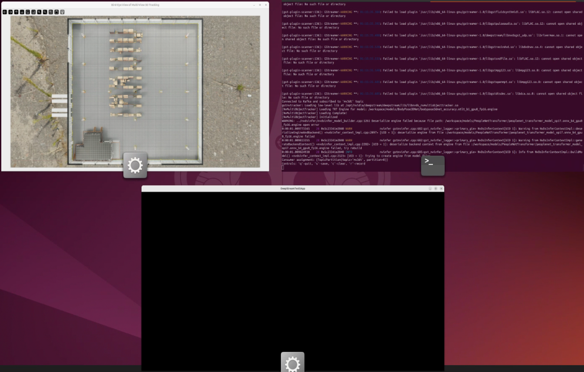
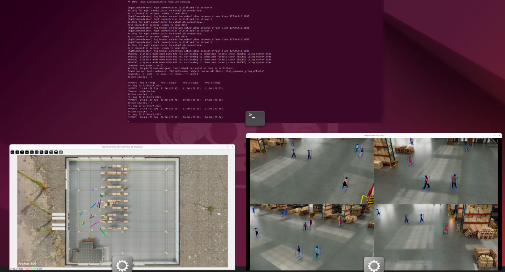
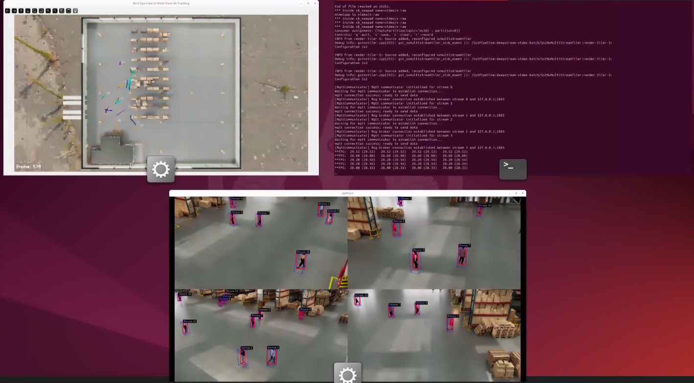
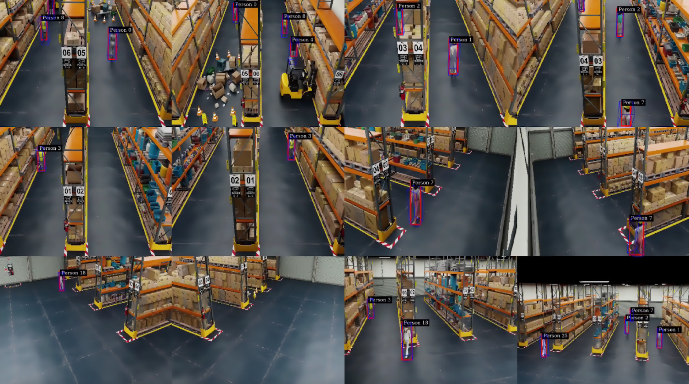
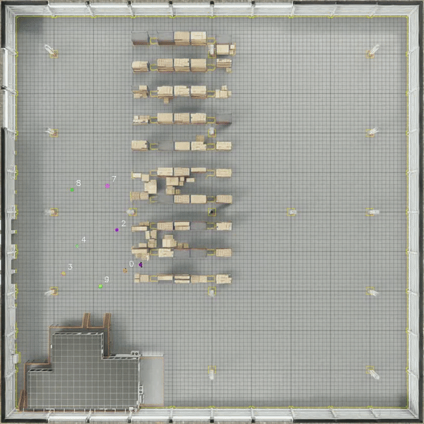
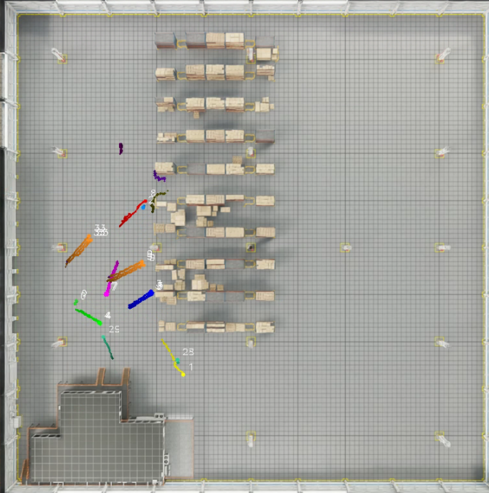
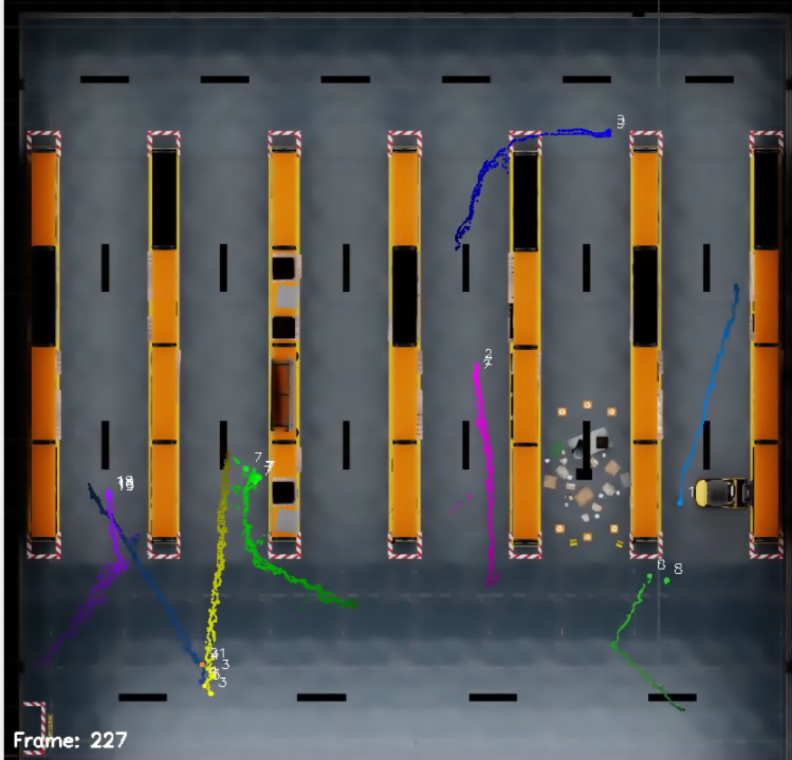

#  Multi-View 3D Tracking in DeepStream


## Introduction

This repository provides sample applications for Multi-View 3D Tracking (MV3DT) with DeepStream 8.0 SDK. MV3DT is a distributed, real-time multi-view multi-target 3D tracking framework built for large-scale, calibrated camera networks. It is designed to deliver robust object tracking and identity consistency across complex environments, leveraging camera calibration data as a prerequisite for accurate geometric reasoning. 

This repository aims to demonstrate MV3DT through live visualization of 3D tracking results, and is structured as follows:
- **[Prerequisites](#prerequisites)** - System requirements and setup instructions
- **[Option 1: Sample applications using DeepStream Container](#option-1-running-mv3dt-using-deepstream-container)** - The DeepStream Container has the DeepStream SDK pre-installed. The samples automate MV3DT config generation and launch the DeepStream app inside the container.
- **[Option 2: Sample applications using Inference Builder](#option-2-running-mv3dt-using-inference-builder)** - Inference Builder is an open-source tool that automates inference pipeline generation across AI frameworks and packages them as deployable containers. The samples in this repo are solely intended to demonstrate building and running MV3DT using Inference Builder. For additional capabilities, see the [Inference Builder README](https://github.com/NVIDIA-AI-IOT/inference_builder).
- **[Output Visualization Explanations](#output-visualization)** - Expected visualization from DeepStream On-Screen Display (OSD) and real-time Bird's Eye View (BEV) app
- **[Customization](#customization)** - How to use MV3DT on custom datasets, and how to convert existing 2D DeepStream tracking pipelines to MV3DT pipeline

As shown in the repo structure, MV3DT can be run using either DeepStream Container or Inference Builder. You can choose either approach to run the sample applications. We recommend starting with DeepStream Container for quick start and optionally trying out Inference Builder for advanced use cases, for example, integrating it with other AI frameworks or microservices.

## Prerequisites
The sample applications in this repository require Ubuntu 24.04 and NVIDIA driver version 570.86.15 (or higher 570 release); both x86 and Jetson platforms are supported. A graphical display server (e.g., X11) is required to view visualization results. If no physical display is available, a remote desktop solution such as VNC Viewer can be used as an alternative.

Known issue: On Jetson Thor, Option 2 Sample 2 (with Inference Builder, on 12-camera dataset) may hang due to file descriptor limitation in the third-party library libmosquitto. This issue is planned to be fixed in the next release.


1. Please check [DeepStream Container Prerequisites](https://docs.nvidia.com/metropolis/deepstream/dev-guide/text/DS_docker_containers.html#prerequisites) for DeepStream container setup.

2. Git clone the current `deepstream_reference_apps` repository to the host machine and enter `deepstream-tracker-3d-multi-view` directory
    ```bash
    # Install Git LFS
    sudo apt install git-lfs
    git lfs install

    git clone https://github.com/NVIDIA-AI-IOT/deepstream_reference_apps.git
    cd deepstream_reference_apps/deepstream-tracker-3d-multi-view
    git lfs pull  # In case repo is already cloned before installing git-lfs
    ```

3. Run the automated prerequisites setup script:

    The setup script takes about 10-20 minutes to complete. And it may prompt you to enter your password for sudo access and github credentials. After the initial setup, if you close the session or restart your machine, you can still use this script to set up and check prerequisites, then the completion time will be much shorter.

    ```bash
    # For DeepStream Container only (Option 1)
    ./scripts/setup_prerequisites.sh

    # Additionally, if you want to try out Inference Builder (Option 2)
    USE_INFERENCE_BUILDER=true ./scripts/setup_prerequisites.sh

    # [Expected output]: For both options, you should see all items checked with "✓" under "PREREQUISITES CHECK SUMMARY", and in the last line you should see:
    # [SUCCESS] Prerequisites check passed! You're ready to use MV3DT.
    ```

    **Environment Variables:**
    - `USE_INFERENCE_BUILDER` - Enable Inference Builder setup (default: false, DeepStream Container only)
    - `BASE_DIR` - Base directory for Kafka and Inference Builder installations (default: `$HOME`)
    - `DEEPSTREAM_IMAGE` - DeepStream Docker image (default: `nvcr.io/nvidia/deepstream:8.0-triton-multiarch` for x86 and Jetson platforms)

    * **Use case 1: If you want to use a different base directory** for Kafka and Inference Builder installations other than `$HOME`, you can set the `BASE_DIR` environment variable before running the script.
        ```bash
        export BASE_DIR=/path/to/your/preferred/base/directory
        # If you want to use Inference Builder (Option 2), uncomment the lines below
        # export USE_INFERENCE_BUILDER=true
        # export INFERENCE_BUILDER_DIR="$BASE_DIR/inference_builder"
        ./scripts/setup_prerequisites.sh
        ```
    * **Use case 2: If you are on ARM SBSA platforms**, the DeepStream docker image will be different from the default one. Please set the `DEEPSTREAM_IMAGE` environment variable before running the script.
        ```bash
        export DEEPSTREAM_IMAGE=nvcr.io/nvidia/deepstream:8.0-triton-arm-sbsa
        # If you want to use Inference Builder (Option 2), uncomment the line below
        # export USE_INFERENCE_BUILDER=true
        ./scripts/setup_prerequisites.sh
        ```


    For manual setup, troubleshooting, or shutdown instructions for Kafka and Mqtt brokers, see: [Manual Setup Instructions](docs/manual-setup.md)


## Option 1: Running MV3DT using DeepStream Container

The following examples demonstrate running MV3DT using DeepStream container. Note that the configurations are auto-generated from `config_templates` using the [auto-configurator](utils/README.md#deepstream_auto_configuratorpy).

### Sample 1: 4-camera dataset
---

#### Quick Start
Run the provided script to quickly launch the 4-camera DeepStream pipeline. 

```bash
cd <path to current repo, i.e. deepstream-tracker-3d-multi-view>

sudo xhost + # give container access to display, only need to run once per session
# [expected output]: access control disabled, clients can connect from any host

# chmod +x scripts/test_4cam_ds.sh
./scripts/test_4cam_ds.sh
```

Two separate windows will be launched. One named **Bird-Eye View of Multi-View 3D Tracking**, and the other named **DeepStreamTest5App**. You may need to toggle, arrange, or resize the windows to see both views. If anything goes wrong or the windows are not showing, please follow the step-by-step instructions below; otherwise, the quick-start script covers the same processes. 

**Note 1 (Important): When the script is launched for the first time, it tries to create model engine files use by MV3DT, which may take about 15 minutes, depending on HW platforms.** This process is only needed once for each dataset, and subsequent runs will use the generated engine files and launch immediately.

**Note 2:** It's expected to see the following warnings. Those warnings will not affect the accuracy or performance of the pipeline.
- Load engine failed. Create engine again.
- INT8 calibration file not specified. Trying FP16 mode.
- GStreamer-WARNING

**Window 1: Bird-Eye View of Multi-View 3D Tracking**
- This window shows the bird's-eye view of the multi-view 3D tracking results. It will show as blank map at the beginning.
- **The BEV visualization window will not exit automatically. To close the window, select the window and press 'q'.**


**Window 2: DeepStreamTest5App**
- This window shows the DeepStream on-screen display (OSD) of 4 camera views in a grid. This window is directly from Deepstream pipeline, and will show as black window at the beginning.
- To view a specific camera view in the DeepStream OSD window, left-click on the desired view. To return to the multi-camera grid view, simply right-click anywhere in the window.
- **The DeepStreamTest5App will exit automatically. To quit the DeepStreamTest5App window early, select the window and press 'q'.** After you press 'q', the app will terminate within a few seconds, and finally you will see "App run successful" printed.
- Note about window name: MV3DT is built upon DeepStreamTest5App with specific config files, which is why the window displays "DeepStreamTest5App" as its title. This base application provides essential IoT protocol support (Kafka and MQTT) required by MV3DT. Currently, the window name cannot be changed. For more details, see the [DeepStreamTest5App documentation](https://docs.nvidia.com/metropolis/deepstream/dev-guide/text/DS_ref_app_test5.html).


**Expected output during engine generation period from window overview/spread:**



**Expected output after pipeline starts:**



#### Step-by-step Instructions
1. Set up environment variables and prepare experiment directories
    ```bash
    export DATASET_DIR=$PWD/datasets/mtmc_4cam/
    export EXPERIMENT_DIR=$PWD/experiments/deepstream/4cam
    export MODEL_REPO=$PWD/models

    mkdir -p $EXPERIMENT_DIR/infer-kitti-dump
    mkdir -p $EXPERIMENT_DIR/tracker-kitti-dump
    mkdir -p $EXPERIMENT_DIR/outVideos
    ```
2. Generate DeepStream configuration files using the auto-configurator
   
   The auto-configurator automatically generates all necessary configuration files based on your dataset. It supports various output options (OSD display, video file output, Kafka streaming) and can work with both 2D and 3D tracker configurations. 
   
   **About Override Files:** The `--config-overrides` parameter allows you to apply dataset-specific settings. For example, `override_tracker_4cam.yml` is optimized for the sample 4-camera dataset (which uses feet as world coordinate units), while `override_tracker_12cam.yml` is optimized for the sample 12-camera dataset (which uses meters). You can create custom override files for your own datasets.
   
   For more info on the auto-configurator, see [`utils/README.md`](utils/README.md#deepstream_auto_configuratorpy).
   
    ```bash
    # Activate the Python environment
    source mv3dt_venv/bin/activate
    
    # Generate configs with 4-camera overrides
    python utils/deepstream_auto_configurator.py \
        --dataset-dir=$DATASET_DIR \
        --enable-msg-broker \
        --enable-osd \
        --config-overrides=override_tracker_4cam.yml \
        --output-dir=$EXPERIMENT_DIR
    
    # [Expected output] You should see
    #   Generated files:
    #     - config_deepstream.txt (main pipeline config)
    #     - config_tracker.yml (3D tracker config)
    #     - config_msgconv.txt (message converter config)
    #     - pub_sub_info_config_0.yml (communication config)

    ```
3. (Optional) Launch real-time BEV visualization
    
    Before launching the main MV3DT pipeline, optionally start the bird's-eye view visualizer to see real-time 3D tracking results. Please keep it running in a separate terminal window or add `&` to the end of the command to run it in the background.
    
    ```bash
    # Start BEV visualization
    python utils/kafka_bev_visualizer.py \
        --dataset-path=$DATASET_DIR \
        --msgconv-config=$EXPERIMENT_DIR/config_msgconv.txt \
        --average-multi-cam \
        --show-ids 

    # [Expected output] You should see a window named "Bird-Eye View of Multi-View 3D Tracking" pop up and will display the live tracking results.
    # Select the window and press 'q' to quit.
    ```

4. Launch MV3DT

    The following command mounts the necessary folders into the DeepStream container and starts the `deepstream-test5-app` with MV3DT configs. 

    ```bash
    sudo xhost + # give container access to display

    docker run -t --privileged --rm --net=host --runtime=nvidia \
        -v $MODEL_REPO:/workspace/models \
        -v $DATASET_DIR:/workspace/inputs \
        -v $EXPERIMENT_DIR:/workspace/experiments \
        -v /tmp/.X11-unix/:/tmp/.X11-unix \
        -e DISPLAY=$DISPLAY \
        -w /workspace/experiments \
        nvcr.io/nvidia/deepstream:8.0-triton-multiarch \
        deepstream-test5-app -c config_deepstream.txt

    # [Expected output] You should see a window named "DeepStreamTest5App" pop up and will display 4 camera views in a grid.
    # Select the window and press 'q' to quit early.
    # The pipeline will quit automatically with "App run succesful" as the last line from the logs.
    ```

### Sample 2: 12-camera dataset
---

#### Quick Start
Run the provided script to quickly launch the 12-camera DeepStream pipeline. For detailed window explanations and important notes, see the [4-camera Quick Start section](#quick-start) above.

```bash
# sudo xhost + # give container access to display

# chmod +x scripts/test_12cam_ds.sh
./scripts/test_12cam_ds.sh
```
#### Step-by-step Instructions
The steps are the same as for the 4-camera dataset, except setting `DATASET_DIR` and `EXPERIMENT_DIR` to the 12-camera directories. The auto-configurator automatically detects the number of cameras in your dataset and generates required config files for 12-camera dataset.

```bash
export DATASET_DIR=$PWD/datasets/mtmc_12cam/
export EXPERIMENT_DIR=$PWD/experiments/deepstream/12cam

# Generate configs with 12-camera overrides
# Note: override_tracker_12cam.yml contains dataset-specific settings (12-cam uses meters as world coordinates)
python utils/deepstream_auto_configurator.py \
    --dataset-dir=$DATASET_DIR \
    --enable-msg-broker \
    --enable-osd \
    --config-overrides=override_tracker_12cam.yml \
    --output-dir=$EXPERIMENT_DIR
```

## Option 2: Running MV3DT using Inference Builder

Inference Builder is a tool that automatically generates inference pipelines and integrates them into either a microservice or a standalone application. In the samples in this repo, it is used to generate a Python package containing the MV3DT inference flow.

Compared to traditional DeepStream configuration files, the Inference Builder configuration (e.g., `config_templates/ds_mv3dt.yaml`) is significantly simpler and more concise, making it easier to define and modify.

### Sample 1: 4-camera dataset
---

#### Quick Start

Run the provided script to quickly start the 4-camera DeepStream Inference Builder pipeline.
```bash
# sudo xhost + # give container access to display

# If you changed BASE_DIR in the prerequisites setup, you need to export INFERENCE_BUILDER_DIR to the correct path
# export INFERENCE_BUILDER_DIR=<path-to-inference-builder-repo>

# chmod +x scripts/test_4cam_ib.sh
./scripts/test_4cam_ib.sh
```

For detailed window explanations and important notes, see the [4-camera DeepStream Quick Start section](#quick-start) above. Additional notes:


**Note 1:** By default, the application waits **1000 seconds** if there is no data being streamed before exiting gracefully. It is expected to see 0 FPS printed during the 1000 seconds wait time. This waiting time is controlled by the `inference_timeout` parameter in `config_templates/ds_mv3dt.yaml`. To avoid this delay:
* Option 1: Pre-generate the engine files and place them in the correct directories before starting the pipeline. Then, set `inference_timeout` to a lower value (e.g., 30 seconds).
* Option 2: Use the default 1000-second timeout for the initial run to allow engine file creation. For later runs, reduce `inference_timeout` (e.g., to 30 seconds) so the container exits promptly after inference completes.

**Note 2: To quit the app early**, run this command in a separate terminal to stop the container:
`docker ps -q --filter "ancestor=inference-builder-mv3dt" | xargs docker stop`. 

If you are not able to see camera view or BEV view, please follow the step-by-step instructions; otherwise, the quick-start script covers the same processes.


**Expected output from window overview/spread:**



#### Step-by-step Instructions

1. Set up environment variables and prepare experiment directories
    ```bash
    export DATASET_DIR=$PWD/datasets/mtmc_4cam/
    export EXPERIMENT_DIR=$PWD/experiments/inference_builder/4cam
    export MODEL_REPO=$PWD/models

    mkdir -p $EXPERIMENT_DIR/infer-kitti-dump
    mkdir -p $EXPERIMENT_DIR/tracker-kitti-dump
    ```

2. Generate Inference Builder configuration files using the auto-configurator
    
    ```bash
    # Activate the Python environment
    source mv3dt_venv/bin/activate
    
    # Generate configs with 4-camera overrides
    python utils/inference_builder_auto_configurator.py \
        --dataset-dir=$DATASET_DIR \
        --config-overrides=override_tracker_4cam.yml \
        --output-dir=$EXPERIMENT_DIR
    # [Expected output] You should see 
    #   Generated files:
    #     - ds_mv3dt.yaml (inference config with max_batch_size: 4)
    #     - config_tracker.yml (3D tracker config)
    #     - source_list_static.yaml (source configuration)
    #     - nvdsinfer_config.yaml (inference engine config with batch_size: 4)
    #     - config_msgconv.txt (message converter config)
    #     - pub_sub_info_config_0.yml (communication config)

    # Copy the generated nvdsinfer config to the model directory
    cp $EXPERIMENT_DIR/nvdsinfer_config.yaml $MODEL_REPO/PeopleNetTransformer/
    ```

3. Generate a Python package at `$INFERENCE_BUILDER_DIR/builder/samples/mv3dt_app` containing the MV3DT inference flow.
    ```bash
    export INFERENCE_BUILDER_DIR=<path to inference builder repo>
    cd $INFERENCE_BUILDER_DIR
    source ib_venv/bin/activate
    python builder/main.py $EXPERIMENT_DIR/ds_mv3dt.yaml \
        -o builder/samples/mv3dt_app \
        --server-type serverless
    ```

4. (Optional) Launch real-time BEV visualization.
    Please keep it running in a separate terminal window or add `&` to the end of the command to run it in the background.
    
    ```bash
    # Return to the repo directory and activate the Python environment
    cd <path to current repo, i.e. deepstream-tracker-3d-multi-view>
    source mv3dt_venv/bin/activate
    
    # Start BEV visualization
    python utils/kafka_bev_visualizer.py \
        --dataset-path=$DATASET_DIR \
        --msgconv-config=$EXPERIMENT_DIR/config_msgconv.txt \
        --average-multi-cam \
        --show-ids

    # [Expected output] You should see a window named "Bird-Eye View of Multi-View 3D Tracking" pop up and will display the live tracking results. 
    # Select the window and press 'q' to quit.
    ```

5. Launch the `inference-builder-mv3dt:latest` container with volume mounts, including the Python package generated in the previous step.

    Note that this container is built during prerequisites setup. Please refer to the Inference Builder setup step in [Manual Setup Instructions](docs/manual-setup.md) for more details.
    ```bash
    sudo xhost + # give container access to display

    docker run --privileged --rm -it --net=host --runtime=nvidia \
    -v $INFERENCE_BUILDER_DIR/builder/samples/mv3dt_app/deepstream-app:/mv3dt_app \
    -v $MODEL_REPO:/workspace/models \
    -v $DATASET_DIR:/workspace/inputs \
    -v $EXPERIMENT_DIR:/workspace/experiments \
    -v /tmp/.X11-unix/:/tmp/.X11-unix \
    -e DISPLAY=$DISPLAY \
    -w /mv3dt_app \
    inference-builder-mv3dt:latest \
    python3 __main__.py --source-config /workspace/experiments/source_list_static.yaml -s /dev/null

    # [Expected output] You should see a window named "python3" pop up and will display 4 camera views in a grid.
    # Run this command to quit early: `docker ps -q --filter "ancestor=inference-builder-mv3dt" | xargs docker stop`.
    # By default, the application waits up to **1000 seconds** if there is no data being streamed before exiting gracefully. You should see "Inference completed" as the last line from the logs.
    ```


### Sample 2: 12-camera dataset
---

#### Quick Start
Run the provided script to quickly start the 12-camera DeepStream Inference Builder pipeline.

For detailed window explanations and important notes, see the [4-camera DeepStream Quick Start section](#quick-start) above. 

```bash
# sudo xhost + # give container access to display

# If you changed BASE_DIR in the prerequisites setup, you need to export INFERENCE_BUILDER_DIR to the correct path
# export INFERENCE_BUILDER_DIR=<path-to-inference-builder-repo>

# chmod +x scripts/test_12cam_ib.sh
./scripts/test_12cam_ib.sh
```

#### Step-by-step Instructions

The steps are the same as for the 4-camera dataset, except setting `DATASET_DIR` and `EXPERIMENT_DIR` to the 12-camera directories.

```bash
export DATASET_DIR=$PWD/datasets/mtmc_12cam/
export EXPERIMENT_DIR=$PWD/experiments/inference_builder/12cam

# Generate configs with 12-camera overrides
python utils/inference_builder_auto_configurator.py \
    --dataset-dir=$DATASET_DIR \
    --config-overrides=override_tracker_12cam.yml \
    --output-dir=$EXPERIMENT_DIR
```


## Output Visualization
Whether you use Option 1 (DeepStream Container) or Option 2 (Inference Builder), both approaches launch two windows with similar visualizations. This section explains and demonstrates the content of these visualization windows.

### DeepStream Direct Visualization
---
When the pipeline is launched, DeepStream shows the output video like below while processing the input video. In the example frames below, you can see that objects detected across different cameras are assigned globally consistent IDs. And both 2D and 3D bounding boxes are visualized for each tracked object.

The example below shows per-camera visualization results from the MV3DT Inference Builder pipeline. Note that the on-screen display (OSD) output from the DeepStream container may appear slightly different. To view a specific camera view in the DeepStream OSD window, left-click on the desired view. To return to the multi-camera grid view, simply right-click anywhere in the window.

<p align="center">
  <b>4-camera Example:</b><br>
  
</p>

<p align="center">
  <b>12-camera Example:</b><br>
  
</p>

#### Disabling DeepStream Direct Visualization

If you don't need on-screen display, you can disable it:

* **For DeepStream Container:**
    * Remove the `--enable-osd` option from `deepstream_auto_configurator.py` command in the quick-start script and run again.

* **For Inference Builder:**
    * Comment out the `render_config` section in `config_templates/ds_mv3dt.yaml` and run the quick-start script again.


### Real-time BEV visualization of 3D metadata from Kafka
---

The `kafka_bev_visualizer.py` script provides real-time bird's-eye view (BEV) visualization of 3D tracking data streamed via Kafka. 

Note that the BEV visualization script should be launched before launching the MV3DT app.

* Command:
    ```bash
    python utils/kafka_bev_visualizer.py \
        --dataset-path=$DATASET_DIR \
        --msgconv-config=$EXPERIMENT_DIR/config_msgconv.txt \
        --show-ids \
        --average-multi-cam
    ```
* Expected outputs (left: 4-camera, right: 12-camera)
    <div>
      
      
    </div>


* Note that the BEV visualization shows fused tracks, where trajectories of the same object from multiple cameras are averaged into one. If you want to see the individual trajectories from every camera, simply remove the `--average-multi-cam` option from the command. The output will then look like this:
    <div>
      
      
    </div>

# Customization

This section provides customization options for the MV3DT pipeline. If you are new to DeepStream and want to try MV3DT on your own dataset, see [Running MV3DT on Custom Datasets](#running-mv3dt-on-custom-datasets). If you already have a working 2D DeepStream tracking pipeline, see [Converting your Existing 2D DeepStream Tracking Pipeline to MV3DT](#converting-your-existing-2d-deepstream-tracking-pipeline-to-mv3dt) for simple transformation to multi-view 3D pipeline.


## Running MV3DT on Custom Datasets

**Requirements:**
- Multi-view video streams must be synchronized.
- All video streams must have the same resolution.
- Camera calibration parameters (projection matrices) must be available.

### Steps
---

1. **Organize your dataset** with the following structure:
   ```
   your_dataset/
   ├── videos/
   │   ├── camera1.mp4
   │   ├── camera2.mp4
   │   └── ...
   ├── camInfo/
   │   ├── camera1.yml
   │   ├── camera2.yml
   │   └── ...
   ├── map.png (optional, for BEV visualization)
   └── transforms.yml (optional, for BEV visualization)
   ```

2. **Create camera calibration files** following the format of `datasets/mtmc_4cam/camInfo/Warehouse_Synthetic_Cam001.yml`. Replace the `projectionMatrix_3x4_w2p` values with your camera's projection matrix. For more details about these files, please refer to the [Single-View 3D Tracking](https://docs.nvidia.com/metropolis/deepstream/dev-guide/text/DS_plugin_gst-nvtracker.html#single-view-3d-tracking) and [The 3x4 Camera Projection Matrix](https://docs.nvidia.com/metropolis/deepstream/dev-guide/text/DS_plugin_gst-nvtracker.html#the-3x4-camera-projection-matrix) sections of the DeepStream documentation.

3. **Optional: BEV visualization setup** - Prepare a BEV map image and create a `transforms.yml` file specifying the projection matrix that maps world coordinates (in meters) to BEV image coordinates, following the sample format in `datasets/mtmc_4cam/transforms.yml`.

4. **Generate configurations** using the auto-configurator. Refer to `scripts/test_4cam_ds.sh` for the exact python command and environment variables needed.

5. **Launch the MV3DT pipeline** using your generated configs. Refer to `scripts/test_4cam_ds.sh` for the exact Docker command and environment variables needed.


### How It Works
---
The auto-configurator generates a complete set of MV3DT config files tailored to your dataset:

1. **Detects dataset structure** - Scans your `videos/` and `camInfo/` directories to determine camera count and calibration files
2. **Generates pipeline configuration** - Creates `config_deepstream.txt` with appropriate source URIs, batch sizes, and display grid layout based on detected cameras
3. **Creates inter-camera communication configs** - Generates `pub_sub_info_config_0.yml` defining camera neighbor relationships for multi-view data sharing
4. **(Optional) Applies overrides** - Uses override files to customize tracker settings for specific datasets or requirements

For detailed usage and all available options, see the **[Auto-Configurator Documentation](utils/README.md)**.


## Converting your Existing 2D DeepStream Tracking Pipeline to MV3DT
If you have an existing 2D detection and tracking pipeline using DeepStream, the auto-configurator can automatically enhance it to support multi-view 3D tracking, provided you have camera calibration files available.

### Steps
---

1. **Organize your dataset** as in the previous [Running MV3DT on Custom Datasets](#running-mv3dt-on-custom-datasets) section.

2. **Create camera calibration files** as in the previous section.

3. **Optional: BEV visualization setup** (required if you want to enable BEV visualization) 
    - Follow the instructions in the previous section.

4. **Optional: Set up your model configs** (required if using a different detector than PeopleNetTransformer)
    - For example, if you are using PeopleNet as your detector, create a `PeopleNet` folder under `models` and modify `config_templates/config_pgie.txt` to point to your model files.

5. **Optional: Set up your DeepStream pipeline config** (required if using a custom DeepStream pipeline config) 
    - Modify `config_templates/config_deepstream.txt` based on your use case. For example, if you have a custom `[pre-process]` section, copy that section to `config_templates/config_deepstream.txt`. Note that `[source%d]` and `[sink%d]` sections will be handled by the auto-configurator.

6. **Place your tracker config file in the `config_templates` folder.** 


7. **Generate MV3DT configs** 
    - Use the auto-configurator with `--tracker-config` argument, i.e. suppose your tracker config file is named `config_tracker_custom_2d.yml`, pass `--tracker-config=config_tracker_custom_2d.yml` to the auto-configurator. The auto-configurator assumes all template configs are located in the `config_templates` folder, so only the file name is needed, not the full path.

8. **Launch the MV3DT pipeline** using your generated configs. 


### A Step-by-step Example
---

1. To simulate a custom dataset, let's create a 6-camera subset (randomly selected) from the 12-camera dataset. Run the following command to generate a new dataset in `datasets/mtmc_6cam`.
    ```bash
    ./scripts/create_6cam_subset.sh
    ```

2. Assume you have an existing 2D tracking config file. In this example, we will use the `config_tracker_2d.yml` file in the `config_templates` folder.

3. Set up output directories and run the auto-configurator to generate the MV3DT config files.
    ```bash
    export DATASET_DIR=$PWD/datasets/mtmc_6cam/
    export EXPERIMENT_DIR=$PWD/experiments/deepstream/6cam

    mkdir -p $EXPERIMENT_DIR/infer-kitti-dump
    mkdir -p $EXPERIMENT_DIR/tracker-kitti-dump

    python utils/deepstream_auto_configurator.py \
        --dataset-dir=$DATASET_DIR \
        --tracker-config=config_tracker_2d.yml \
        --config-overrides=override_tracker_12cam.yml \
        --enable-msg-broker \
        --enable-osd \
        --output-dir=$EXPERIMENT_DIR
    ```

4. Launch the MV3DT pipeline:
    ```bash
    export MODEL_REPO=$PWD/models

    docker run -t --privileged --rm --net=host --runtime=nvidia \
        -v $MODEL_REPO:/workspace/models \
        -v $DATASET_DIR:/workspace/inputs \
        -v $EXPERIMENT_DIR:/workspace/experiments \
        -v /tmp/.X11-unix/:/tmp/.X11-unix \
        -e DISPLAY=$DISPLAY \
        -w /workspace/experiments \
        nvcr.io/nvidia/deepstream:8.0-triton-multiarch \
        deepstream-test5-app -c config_deepstream.txt
    ```

* For convenience, the same process is automated in the following scripts:

    ```bash
    # Create the 6-camera dataset if not already done
    # ./scripts/create_6cam_subset.sh

    # Option 1: using DeepStream Container
    ./scripts/test_custom_2d_tracker_ds.sh

    # Option 2: using Inference Builder
    ./scripts/test_custom_2d_tracker_ib.sh
    ```

### How It Works
---
The auto-configurator generates a complete set of MV3DT config files based on your custom 2D tracker, pipeline, and model configs, as well as your dataset.

1. **Detects dataset structure** - Scans your `videos/` and `camInfo/` directories to determine camera count and calibration files
2. **Generates pipeline configuration** - Uses your updated `config_templates/config_deepstream.txt` as template and generates `$EXPERIMENT_DIR/config_deepstream.txt` with appropriate source URIs, batch sizes, and display grid layout
3. **Extends 2D tracker configs with MV3DT additional sections** - automatically injects MV3DT sections (`ObjectModelProjection` for 3D model projection, `MultiViewAssociator` for multi-view association, and `Communicator` for inter-camera communication) to your 2D tracker config
4. **Creates inter-camera communication configs** - Generates `$EXPERIMENT_DIR/pub_sub_info_config_0.yml` defining camera publish/subscribe relationships for multi-view data sharing
5. **(Optional) Applies overrides** - Uses override files to customize tracker settings for specific datasets or requirements

For detailed usage and all available options, see the **[Auto-Configurator Documentation](utils/README.md)**.


## Python Util Scripts

For more details on python utility scripts including auto-configuration generators and visualization tools, see
📁 **[Python Util Scripts Documentation](utils/README.md)**


