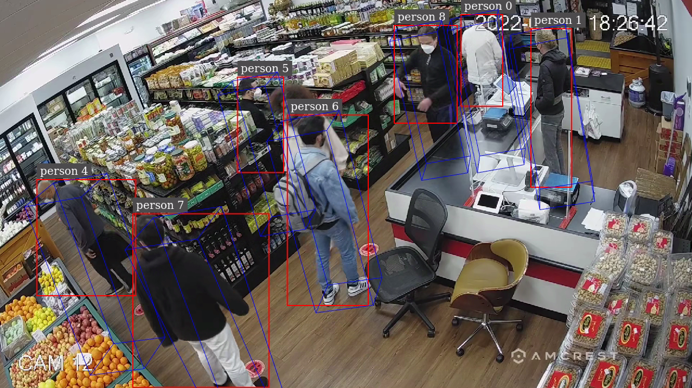

#  Single-View 3D Tracking in DeepStream

## Introduction
This sample application demonstrates the single-view 3D tracking with DeepStream SDK. Given the [camera matrix and human model](configs/camInfo.yml) of a static camera, this application estimates and keeps tracking of object states in the 3D physical world. It can recover the complete bounding box, foot location and body convex hulls precisely from partial occlusions. For algorithm and setup details, please refer to [DeepStream Single View 3D Tracking Documentation](https://docs.nvidia.com/metropolis/deepstream/dev-guide/text/DS_plugin_gst-nvtracker.html#single-view-3d-tracking-alpha).

## Prerequisites
This sample application can be run on both x86 and Jetson platforms inside DeepStream container. Check [here](https://docs.nvidia.com/metropolis/deepstream/dev-guide/text/DS_docker_containers.html#prerequisites) for DeepStream container setup.
1. Download the latest DeepStream container image from NGC (e.g., DS 7.1 in the example below)
    ```bash
    export DS_IMG_NAME="nvcr.io/nvidia/deepstream:7.1-triton-multiarch"
    docker pull $DS_IMG_NAME
    ```

2. Git clone the current `deepstream_reference_apps` repository to the host machine, and enter single-view 3D tracking directory inside the repository.
    ```bash
    git clone https://github.com/NVIDIA-AI-IOT/deepstream_reference_apps.git
    cd deepstream_reference_apps/deepstream-tracker-3d
    ```

3. Download NVIDIA pretrained `PeopleNet` for detection from [NGC](https://catalog.ngc.nvidia.com/orgs/nvidia/teams/tao/models/peoplenet/files?version=deployable_quantized_onnx_v2.6.3(e.g., PeopleNet v2.6.3 in the example below).

    ```bash
    # current directory: deepstream_reference_apps/deepstream-tracker-3d
    mkdir -p models/PeopleNet
    cd models/PeopleNet
    wget --no-check-certificate --content-disposition https://api.ngc.nvidia.com/v2/models/nvidia/tao/peoplenet/versions/deployable_quantized_onnx_v2.6.3/zip -O peoplenet_deployable_quantized_onnx_v2.6.3.zip
    unzip peoplenet_deployable_quantized_onnx_v2.6.3.zip
    ```

    The model files are now stored in `PeopleNet` directory as

    ```bash
    deepstream-tracker-3d
    ├── configs
    ├── streams
    └── models
        └── PeopleNet
            ├── labels.txt
            ├── resnet34_peoplenet.onnx
            └── resnet34_peoplenet_int8.txt
    ```
## Running the Application
Launch the container from current directory, and execute the 3D tracking pipeline inside the container. The current [config](configs/deepstream_app_source1_3d_tracking.txt) requires users to run with a display because it uses EGL sink to visualize the overlay results. To run through ssh without display, please change `type=2` to `1` in group `[sink0]` in that file. Users can check [DeepStream sink group](https://docs.nvidia.com/metropolis/deepstream/dev-guide/text/DS_ref_app_deepstream.html#sink-group) for the usage of each sink.

```bash
cd ../..
sudo xhost + # give container access to display
# current directory: deepstream_reference_apps/deepstream-tracker-3d
docker run --gpus all -it --rm --net=host --privileged -v /tmp/.X11-unix:/tmp/.X11-unix -v $(pwd):/opt/nvidia/deepstream/deepstream/sources/apps/sample_apps/deepstream-tracker-3d -e DISPLAY=$DISPLAY $DS_IMG_NAME
```

Inside container, run the following commands. Please note that when `deepstream-app` is launched for the first time, it tries to create model engine files, which may take a couple minutes, depending on HW platforms.

```bash
# Install prerequisites
cd /opt/nvidia/deepstream/deepstream/
bash user_additional_install.sh

# Download ReID model
export REID_DIR="/opt/nvidia/deepstream/deepstream/samples/models/Tracker"
mkdir -p $REID_DIR
wget 'https://api.ngc.nvidia.com/v2/models/nvidia/tao/reidentificationnet/versions/deployable_v1.0/files/resnet50_market1501.etlt' -P $REID_DIR

# Run 3D tracking pipeline
cd /opt/nvidia/deepstream/deepstream/sources/apps/sample_apps/deepstream-tracker-3d/configs
mkdir -p track_results
deepstream-app -c deepstream_app_source1_3d_tracking.txt
```

## Output Retrival and Visualization

### DeepStream Direct Visualization
When the pipeline is launced, DeepStream shows the output video like below while processing the input video. The bounding boxes are reprojected from 3D to 2D and correspond to full human body even though there are partial occlusions. The result video is saved as `out.mp4`.



### 3D Metadata Processing and Visualization
The extracted metadata (e.g., bounding box, frame num, target ID, etc.) is saved in both extended MOT and KITTI format. For detailed explanation, please refer to [DeepStream Tracker Miscellaneous Data Output](https://docs.nvidia.com/metropolis/deepstream/dev-guide/text/DS_plugin_gst-nvtracker.html#miscellaneous-data-output).

The MOT results can be found in `track_dump_0.txt` file, which contains all the object metadata for one stream, and the data format is defined below. The foot image position and the convex hull of the projected cylindrical human model are defined in video frame coordinates, and can be used to draw the visualization figures below. Users can create such overlay video or image using their favorite tools like [OpenCV](https://github.com/opencv/opencv). The foot world position is defined in the 3D world ground plane corresponding to the 3x4 camera projection matrix.

| frame number(starting from 1) | object unique id | bbox left | bbox top | bbox width | bbox height | confidence | Foot World Position X | Foot World Position Y | blank | class id     | tracker state | visibility | Foot Image Position X | Foot Image Position Y | ConvexHull Points Relative to bbox center             |
|-------------------------------|------------------|-----------|----------|------------|-------------|------------|-----------------------|-----------------------|-------|--------------|---------------|------------|-----------------------|-----------------------|--------------------------------|
|      unsigned int             |long unsigned int | int       |   int    | int        |  int        |  float     |     float             |                float  | int   | unsigned int | int           | float      | float                 | float                 | int separated by vertical bar  |

Sample output is like below. The green dot in the visualization figure is plotted as `(Foot Image Position X, Foot Image Position Y)`, and the cylinder is plotted by connecting convex hull points. For example, the bbox in the first line of the output file has center `(1433, -50)`. Then its convex hull points are `(1433 - 94, -50 - 170), (1433 - 87, -50 - 176), ..., (1433 - 23, -50 + 190)`. Users can plot the foot location and convex hull on their own as shown in the figure below.
```txt
1,1,1366,-195,134,290,1.000,-171.080,1058.295,-1,0,2,0.220,1458,80,-94|-170|-87|-176|-71|-183|-49|-191|-23|-196|0|-200|18|-201|29|-198|95|165|95|173|85|183|66|191|42|198|16|202|-4|201|-18|197|-23|190
2,1,1365,-194,135,290,0.989,-170.646,1045.254,-1,0,2,0.230,1458,84,-94|-170|-87|-176|-71|-183|-49|-191|-23|-196|0|-200|18|-201|29|-198|95|165|95|173|85|183|66|191|42|198|16|202|-4|201|-18|197|-23|190
3,1,1366,-196,134,290,0.860,-170.679,1054.089,-1,0,2,0.229,1458,82,-94|-170|-87|-176|-71|-183|-49|-191|-23|-196|0|-200|18|-201|29|-198|95|165|95|173|85|183|66|191|42|198|16|202|-4|201|-18|197|-23|190
...
```


The KITTI results can be found in `track_results` folder. A file will be created for each frame in each stream, and the data format is defined below.

| object Label | object Unique Id | blank | blank | blank | bbox left | bbox top | bbox right | bbox bottom | blank | blank | blank | blank | blank | blank | blank |confidence | visibility (optional) | Foot Image Position X (optional) | Foot Image Position Y (optional) |
|--------------|------------------|-------|-------|-------|-----------|----------|------------|-------------|-------|-------|-------|-------|-------|-------|-------|-----------|-----------------------|-----------------------|-----------------------|
| string       | long unsigned    | float | int   | float | float     | float    | float      | float       | float | float | float | float | float | float | float | float     | float                 | float                 | float                 |

Each frame is saved as `track_results/00_000_xxxxxx.txt`. Sample output of a frame is like below. Note that if a object is found in past frame data, it wouldn't have visibility and foot position in KITTI dump.
```txt
person 1 0.0 0 0.0 1365.907227 -196.875290 1500.249146 93.554581 0.0 0.0 0.0 0.0 0.0 0.0 0.0 0.890186 0.229870 1458.166992 81.585060
person 6 0.0 0 0.0 1419.655151 72.774818 1647.446167 561.540894 0.0 0.0 0.0 0.0 0.0 0.0 0.0 0.841420 0.408513 1575.264160 531.851746
person 0 0.0 0 0.0 1008.387817 36.228714 1202.886353 421.609314 0.0 0.0 0.0 0.0 0.0 0.0 0.0 0.632065 0.504738 1148.117188 399.992645
...
```

## Customizing the Video
To run the single view 3D tracking on other videos, the following changes are required.
1. In `deepstream_app_source1_3d_tracking.txt`, change `uri=file://../streams/Retail02_short.mp4` to the new video name, `width=1920, height=1080, tracker-width=1920, tracker-height=1080` to the new video's resolution.
2. Generate camera projection matrix for the new video. Change `projectionMatrix_3x4` in `camInfo.yml` into the new matrix.

Note: Multiple streams can run at the same time. Add all the sources to `deepstream_app_source1_3d_tracking.txt`, and all the camera information files to `config_tracker_NvDCF_accuracy_3D.yml`.
```yaml
  cameraModelFilepath:  # In order of the source streams
    - 'camInfo-01.yml'
    - 'camInfo-02.yml'
    - ...
```
