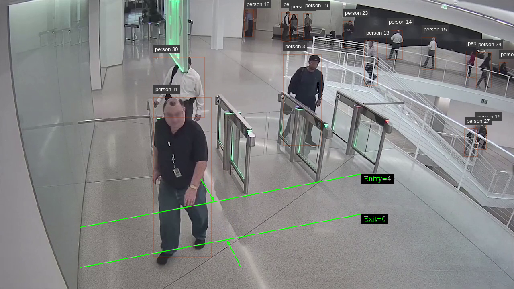
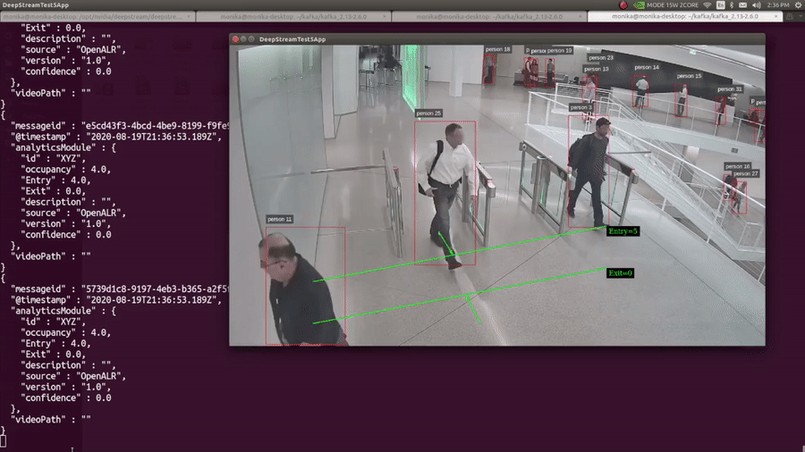

**People count application With Deepstream SDK and Transfer Learning Toolkit**

* [Description](#description)
* [Prerequisites](#prerequisites)
* [Getting Started](#GettingStarted)
* [Build](#build)
* [Run](#run)
* [Output](#output)
* [References](#references)

  

## Description 

  This is a sample application for counting people entering/leaving in a building using NVIDIA Deepstream SDK, Transfer Learning Toolkit (TLT) and pre-trained models. This application can be used to build real-time occupancy analytics application for smart buildings, hospitals, retail, etc. The application is based on deepstream-test5 sample application.

   It takes streaming video as input, counts the number of people crossing a tripwire and sends the live data to the cloud. In this application, you will learn:

  - How to use PeopleNet model from NGC
  - How to use NvDsAnalytics plugin to draw line and count people crossing the line
  - How to send the analytics data to cloud or another microservice over Kafka
 
  You can extend this application to change region of interest, use cloud-to-edge messaging to trigger record in the DeepStream application or build analytic dashboard or database to store the metadata.

To learn how to build this demo step-by-step, check out the on-demand webinar on [Creating Intelligent places using DeepStream SDK](https://info.nvidia.com/iva-occupancy-webinar-reg-page.html?ondemandrgt=yes).

## Prerequisites

- Install Deepstream: [https://docs.nvidia.com/metropolis/deepstream/dev-guide/index.html#page/DeepStream_Development_Guide/deepstream_quick_start.html#]

- Download PeopleNet model: [https://catalog.ngc.nvidia.com/orgs/nvidia/teams/tao/models/peoplenet/files]

- This application is based on deepstream-test5 application. More about test5 application: [https://docs.nvidia.com/metropolis/deepstream/dev-guide/text/DS_ref_app_test5.html]

- Install Kafka: [https://kafka.apache.org/quickstart] and create the kafka topic:

  `tar -xzf kafka_2.13-3.5.0.tgz`

  `cd kafka_2.13-3.5.0`

  `bin/zookeeper-server-start.sh config/zookeeper.properties`

  `bin/kafka-server-start.sh config/server.properties`

  `bin/kafka-topics.sh --create --topic quickstart-events --bootstrap-server localhost:9092`

## Getting Started

- Preferably clone the repo in $DS_SDK_ROOT/sources/apps/sample_apps/ 
- Download peoplnet model: `cd deepstream-occupancy-analytics/config && ./model.sh`
- For Jetson use:  bin/jetson/libnvds_msgconv.so
- For x86 use: bin/x86/libnvds_msgconv.so

## Build and Configure

- Set CUDA_VER in the MakeFile as per platform.

  For Jetson, CUDA_VER=11.4

  For x86, CUDA_VER=11.8

  `cd deepstream-occupancy-analytics && make`

- Set **msg-conv-msg2p-lib** at **[sink1]** group in
  **dstest_occupancy_analytics.txt** as per platform

  For Jetson

  msg-conv-msg2p-lib=$DEEPSTREAM_SDK_PATH/deepstream-occupancy-analytics/bin/jetson/libnvds_msgconv.so

  For x86

  msg-conv-msg2p-lib=$DEEPSTREAM_SDK_PATH/deepstream-occupancy-analytics/bin/x86/libnvds_msgconv.so

## Run 

  `./deepstream-test5-analytics -c config/dstest_occupancy_analytics.txt`

  In another terminal run this command to see the kafka messages:

  `bin/kafka-console-consumer.sh --topic quickstart-events --from-beginning --bootstrap-server localhost:9092`

## Output

  The output will look like this: 

  

  Where you can see the kafka messages for entry and exit count.

## References

- CREATE INTELLIGENT PLACES USING NVIDIA PRE-TRAINED VISION MODELS AND DEEPSTREAM SDK: [https://info.nvidia.com/iva-occupancy-webinar-reg-page.html?ondemandrgt=yes]
- Deepstream SDK: [https://developer.nvidia.com/deepstream-sdk]
- Deepstream Quick Start Guide: [https://docs.nvidia.com/metropolis/deepstream/dev-guide/index.html#page/DeepStream_Development_Guide/deepstream_quick_start.html#]
- Transfer Learning Toolkit: [https://developer.nvidia.com/transfer-learning-toolkit]

